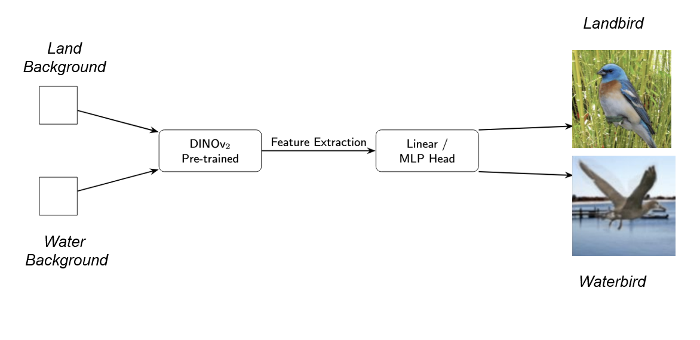

# waterbirds-irm-ssl

# Improving Invariant Risk Minimization with Self-Supervised Learning for OOD Robustness

  
*Authors: Laxmiraman Gudewar, Soham Tolwala — Saarland University*

---

## Overview
Empirical Risk Minimization (ERM) is the dominant training paradigm for deep neural networks but tends to exploit **spurious correlations**, failing under distribution shifts. **Invariant Risk Minimization (IRM)** was proposed to address this by learning predictors that remain optimal across multiple environments. However, IRM (specifically IRMv1) is notoriously hard to optimize.

In this work, we propose a **simple and effective recipe**:  
- **Self-Supervised Pretraining (SSL)** with **DINOv2 (ViT-S/14)** as a frozen backbone.  
- **IRM applied only to a lightweight linear classifier head**.  

This decoupling makes IRM stable and tractable, yielding significant improvements in **worst-group accuracy** on the **Waterbirds dataset**.

---

## Methodology

### Workflow

  

1. **Stage 1 – SSL Backbone**  
   - Use pretrained **DINOv2 ViT-S/14** as a frozen feature extractor.  
   - Outputs 384-dim CLS token embeddings.  

2. **Stage 2 – IRM Head Training**  
   - Train a linear classifier with the **IRM objective** across environments (land vs water).  
   - Apply stabilizing strategies:  
     - Penalty warmup (λ ramp-up to 3–5).  
     - Gradient clipping (‖∇‖ ≤ 1).  
     - AdamW optimizer with cosine decay.  

---

## Results

| Method                  | Avg. Accuracy | Worst-Group Accuracy |
|--------------------------|---------------|-----------------------|
| ERM (baseline)           | ~83%          | ~60%                 |
| IRM (from scratch)       | ~50%          | ~30–40%              |
| **SSL + IRM (ours)**     | **89.2%**     | **72.6%**            |

- **Penalty scheduling** critical: gradual warmup or fixed λ after short burn-in works best.  
- **Grad-CAM analysis** shows that SSL+IRM shifts attention from spurious backgrounds to causal object features.  

